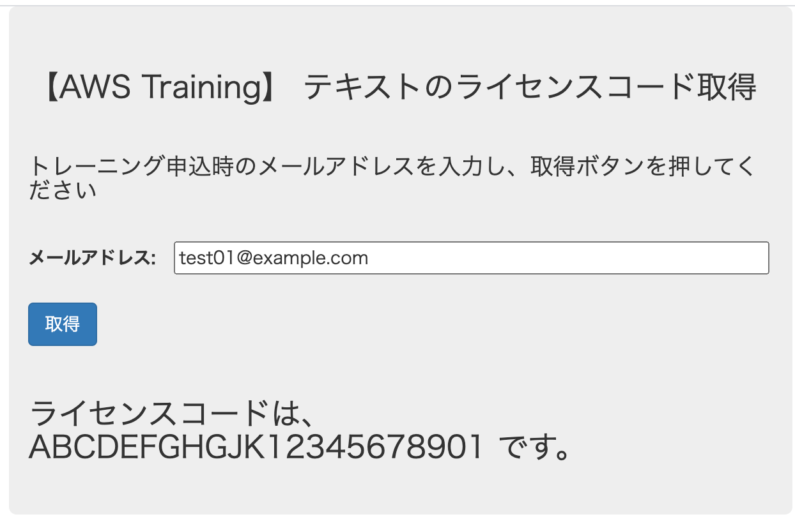
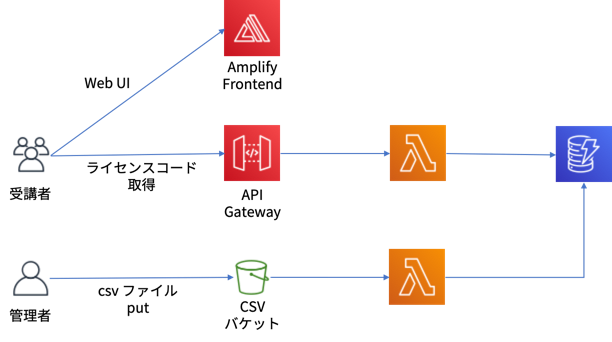

# ライセンスコード配布用アプリケーション

トレーニング実施中のライセンスコード配布用のアプリケーションです。

# 動作



- 受講者は、ご自身のメールアドレスを入力して、取得ボタンを押すとライセンスコードが表示されます
- ライセンスコードと受講者のメールアドレスの紐付けは事前にcsv ファイルに保存してS3 バケットにアップロードすると、DynamoDB に格納されます

# アーキテクチャ図




# 簡単デプロイ

AWS Amplify Console を利用してFrontend/Backend を同時にデプロイ可能です。

[](https://console.aws.amazon.com/amplify/home#/deploy?repo=https://github.com/tomofuminijo/training-distribute-licensecode-app)


上記を実行すると、Backend はCloudFormation にて "training-distribute-code-app" というスタック名で作成されます。  
Frontend はAmplify Console のドメインからアクセス可能です。


# テスト

デプロイが正常に終わったら、Amplify Console のドメインにアクセスして、画面が正常に表示されるか確認してください。  
テストデータが既に格納されていますので、メールアドレスに `test01@example.com` と入力して「取得」ボタンをクリックしてください。  
「ライセンスコードは、ABCDEFGHGJK12345678901 です。」 と表示されれば正常に動作しています。

# 配布するライセンスコードの登録

作成されたバケットにライセンスコードを記述したcsv ファイルをアップロードします。  
以下のフォルダにサンプルcsv を用意していますので、参考にしてください。

backend/sampledata/sample.csv

フォーマットは以下のようになっています。

```
コース名,ライセンスコード,受講者のemail
```

sample.csv の内容
```
Dummy Course,ABCDEFGHGJK12345678901,test01@example.com
Dummy Course,ABCDEFGHGJK12345678902,test02@example.com
```

ファイルを作成したら以下のコマンドでS3 にアップロードしてください。S3 -> Lambda -> DynamoDB の流れで最終的にDynamoDB にデータが格納されます。

```
STACK_NAME=training-distribute-code-app
LICENSE_CODE_BACKET=$(aws cloudformation describe-stacks --stack-name $STACK_NAME --query 'Stacks[*].Outputs[?OutputKey==`BucketName`].OutputValue' --output text)
aws s3 cp your_data.csv s3://$LICENSE_CODE_BACKET
```

# カスタマイズ方法

Backend 用のStack 名は、Amplify Console の環境変数にて `BACKEND_STACKNAME` という変数名でデフォルトの名称から変更することが可能です。  
Stack 内のリソース名は、backend/template.yaml ファイルがSAM テンプレートになりますので、こちらを適宜変更できます。

# リソースの削除方法

## Backend の削除
以下のコマンドを実行することでリソースを削除可能です。

```
STACK_NAME=training-distribute-code-app

# S3 backet を空にする
LICENSE_CODE_BACKET=$(aws cloudformation describe-stacks --stack-name $STACK_NAME --query 'Stacks[*].Outputs[?OutputKey==`BucketName`].OutputValue' --output text)
aws s3 rm s3://$LICENSE_CODE_BACKET --recursive

# SAM により生成されたCFn Stack の削除
aws cloudformation delete-stack --stack-name=$STACK_NAME
aws cloudformation wait stack-delete-complete --stack-name=$STACK_NAME
```

## Frontend の削除
AWS Amplify コンソールから"training-distribute-licensecode-app" を削除してください。


# AWS Amplify Console を利用せずに個別にデプロイする場合

## Backend のDeploy 方法 (SAM によるデプロイ)

事前にSAM CLI をインストールしておいてください。  

[Linux への AWS SAM CLI のインストール - AWS サーバーレスアプリケーションモデル](https://docs.aws.amazon.com/ja_jp/serverless-application-model/latest/developerguide/serverless-sam-cli-install-linux.html)

```
cd backend
sam deploy --guided
```

Configure SAM Daploy のプロンプトで適当に入力してください。（2回目からは単位　`sam deploy` でデプロイできます。)


デプロイが終了したら以下のコマンドで作成されたリソースを確認します。

```
aws cloudformation describe-stacks --stack-name training-distribute-code-app --query 'Stacks[*].Outputs' --output table

```

以下のように表示されます。

```
---------------------------------------------------------------------------------------
|                                   DescribeStacks                                    |
+---------------+---------------------------------------------------------------------+
|   OutputKey   |                             OutputValue                             |
+---------------+---------------------------------------------------------------------+
|  BucketName   |  training-distribute-code-app-licensecodescsvbucket-xxxxxxxxx                   |
|  ApiUri       |  https://xxxxxxx.execute-api.ap-northeast-1.amazonaws.com/prod      |
|  DynamoDBTable|  training-distribute-code-app-LicenseCodesAssignment-xxxxxxx                    |
+---------------+---------------------------------------------------------------------+
```

## データの登録

上記の作成されたバケットにライセンスコードを記述したcsv ファイルをアップロードします。  
以下のフォルダにサンプルcsv を用意していますので、参考にしてください。

backend/sampledata/sample.csv

フォーマットは以下のようになっています。

```
コース名,ライセンスコード,受講者のemail
```

sample.csv の内容
```
Dummy Course,ABCDEFGHGJK12345678901,test01@example.com
Dummy Course,ABCDEFGHGJK12345678902,test02@example.com
```

以下のようにS3 にcsv ファイルをアップロードしてください。

```
cd backend
LICENSE_CODE_BACKET=$(aws cloudformation describe-stacks --stack-name training-distribute-code-app --query 'Stacks[*].Outputs[?OutputKey==`BucketName`].OutputValue' --output text)
aws s3 cp sampledata/sample.csv s3://$LICENSE_CODE_BACKET/sample.csv
```

DyanmoDB テーブルにデータが格納されていることを確認します。


## FrontEnd の確認

### API Gateway のURL をconfig.js に設定する

forntend/src/config.js.org 内の"replace_your_api_url" をCloudFormation のOutput にて取得した、ApiUri に書き換え、config.js にリネームします。

コマンドで実行する場合は以下のようにしてください。

```
cd frontend
ApiUri=$(aws cloudformation describe-stacks --stack-name $BACKEND_STACKNAME --query 'Stacks[*].Outputs[?OutputKey==`ApiUri`].OutputValue' --output text)
sed -e "s|replace_your_api_url|$ApiUri|" src/config.js.org > src/config.js
```

### ローカル実行

以下のコマンドでFront アプリをローカル実行します。

```
npm install
npm run start
```

ローカル実行して問題なければ、以下のようにビルドします。
```
npm run build
```

frontend/build にビルドされたArtifact が出力されるので、S3 などにアップロードして受講者がアクセスできるように公開してください。  

